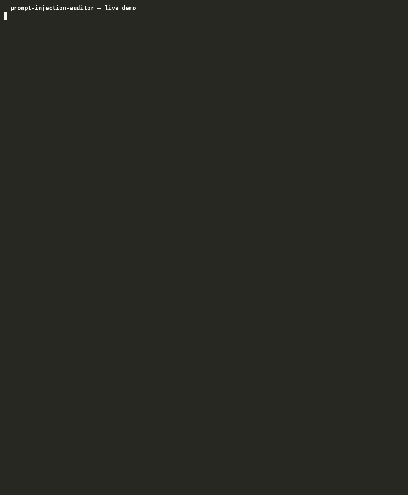

# prompt-injection-auditor

[](https://opensource.org/licenses/Apache-2.0)
[](https://agentskills.io)
[](https://skills.sh)

**An open Agent Skill that turns any AI agent into a prompt-injection security auditor.**
Static scanner + attack catalog + defense checklist + authorized red-team payloads — built against real-world incidents like EchoLeak (CVE-2025-32711).

Works with Claude Code, Cursor, Kimi, and 20+ agents that support the open [Agent Skills](https://agentskills.io) standard.



## Why?

Research evaluations in 2025 found that **over 90% of production LLM agents are susceptible to prompt injection**, and real incidents keep proving it:

- **EchoLeak (CVE-2025-32711, CVSS 9.3)** — the first zero-click prompt injection in a production AI system: hidden instructions in an email made Microsoft 365 Copilot exfiltrate OneDrive/SharePoint data via a markdown image, no clicks needed.
- **LangGrinch (CVE-2025-68664)** — LangChain serialization injection leaking environment secrets through model responses.
- **Langflow (CVE-2025-3248 / CVE-2026-33017)** — unauthenticated RCE in an agent-building framework, exploited within hours of disclosure.

In 2026 the threat moved from framework bugs into the agent runtime itself:

- **MCP tool-server exposure (Flowise CVE-2026-40933, CVSS 9.9; Amazon Q CVE-2026-12957)** — a stdio MCP config is a launcher definition: registering a tool server runs arbitrary commands, and one poisoned workspace file made Amazon Q execute a malicious MCP config and leak AWS credentials.
- **Sandbox escapes (Cursor "DuneSlide" CVE-2026-50548/50549, CVSS 9.8; MS-Agent CVE-2026-2256)** — regex denylists fall to obfuscation, and sandbox trust decisions keyed off agent-chosen paths (working directory, symlinks) fall to zero-click prompt injection.
- **Repo-borne config execution (Codex CLI CVE-2025-61260, CVSS 9.8; Claude Code CVE-2025-59536; Cursor CVE-2025-54136)** — agents auto-load and execute MCP/tool config files from the current repository before any trust check; one malicious repo runs code on open.
- **Slopsquatting (USENIX Security 2025, Spracklen et al.)** — 19.7% of AI-recommended package names don't exist, and 43% of the fakes repeat on every run; attackers pre-register them and agents install them with no human checkpoint.

Most system prompts ship with no instruction hierarchy, no non-disclosure rule, and no untrusted-content handling. This skill finds those weaknesses before attackers do.

## Install

```bash
npx skills add <your-username>/prompt-injection-auditor
```

## Usage

With the skill installed, just ask your agent:

```
Audit this system prompt against prompt injection: [paste prompt]
```

```
Review my SKILL.md for security weaknesses before I publish it.
```

The agent follows a 5-step methodology: collect target -> run the static scanner -> manual review against the attack catalog -> authorized live testing (optional) -> severity-rated report with fixes.

### Standalone scanner (no agent needed)

```bash
python scripts/pi_scan.py system_prompt.txt                 # terminal report
python scripts/pi_scan.py system_prompt.txt --md report.md  # markdown report
python scripts/pi_scan.py system_prompt.txt --json out.json # CI/automation
```

Exit code is `1` when Critical/High findings exist — drop it straight into your CI pipeline.

## Demo

Scanning a vulnerable prompt (hardcoded API key + email/code-execution tools + reads inbox):

```
=== Prompt Injection Audit: vulnerable_prompt.txt ===
Risk score: 100/100 [####################]  SEVERELY EXPOSED — do not deploy before remediation

[Critical] PI-SECRET: Secret-like value present: Hardcoded credential-like value (lines 2)
[Critical] PI-TOOLS: Powerful capabilities declared: Code/command execution capability;
           Network/egress capability; Outbound messaging capability (lines 4, 5)
           Why: The agent has action capabilities AND ingests untrusted content
           (web/email/RAG) — the EchoLeak-class combination.
[   High] PI-NO-HIERARCHY: No explicit instruction hierarchy
[   High] PI-NO-NONDISCLOSE: No non-disclosure rule for the prompt itself
...
Summary: Critical=2, High=4, Medium=2, Low=1
```

A hardened prompt (hierarchy + non-disclosure + delimiters) scores **0/100 — HARDENED**.

## What's inside

```
prompt-injection-auditor/
├── SKILL.md                        # 5-step audit methodology + ethics guardrails
├── scripts/
│   ├── pi_scan.py                  # Zero-dependency static analyzer (~24 weakness classes, incl. 2026 agent-runtime rules)
│   ├── pi_shield.py                # v2.0: layered input defense (5 layers, scored decisions)
│   ├── mcp_guard.py                # v2.2: MCP tool-response guard (JSON-aware)
│   ├── normalization.py            # v2.1: Arabic normalization (diacritics, tatweel, letters)
│   ├── language_rules.py           # v2.1+: Arabic injection, context & runtime rules
│   └── test_shield.py              # 11-case suite proving the shield against evasion
├── tests/
│   ├── test_mcp_guard.py           # 18-case MCP guard suite (v2.2)
│   ├── test_runtime_rules.py       # 19-case 2026 agent-runtime rule suite (v2.2)
│   ├── test_arabic_rules.py        # Arabic injection detection (v2.1)
│   ├── test_normalization.py       # Arabic normalization unit tests (v2.1)
│   ├── test_english_regression.py  # English regression guard
│   └── test_cli.py                 # CLI end-to-end tests
└── references/
    ├── attack-patterns.md          # Direct / indirect / encoding / exfiltration / multi-agent
    ├── attack-patterns-2026.md     # MCP poisoning / sandbox bypass / memory injection / slopsquatting
    ├── defense-checklist.md        # 22 numbered hardening measures
    ├── defense-architecture.md     # The 5-layer shield design + honest limits
    └── test-payloads.md            # Escalation-ordered payloads for authorized live tests
```

### New in v2.2 — 2026 agent-runtime rules (scanner)

pi_scan now 2026 agent-runtime detection rules — MCP tool poisoning, sandbox bypass, memory injection, slopsquatting (v2.2, English + Arabic)
Detection rules for agent-framework CVEs (LangChain / Langflow / LangGraph) (`references/attack-patterns-2026.md`):

- **PI-MCP** — agent can add/register MCP tool servers (Medium/High/Critical tiers; Flowise CVE-2026-40933, Amazon Q CVE-2026-12957, Codex CLI CVE-2025-61260)
- **PI-SANDBOX-BYPASS** — string-based command gates with no obfuscation defense, sandbox trust keyed off agent-chosen paths (MS-Agent CVE-2026-2256, Cursor DuneSlide CVE-2026-50548/50549, Codex CVE-2025-59532)
- **PI-MEMORY** — persistent memory written with no integrity or provenance rule
- **PI-SUPPLY-CHAIN** — agent installs packages it names itself ("slopsquatting")

19-case suite: `python -m unittest tests.test_runtime_rules`.

### New in v2.2 — mcp_guard (MCP tool-response guard)

pi_shield guards the user-input boundary; **mcp_guard guards the tool boundary**. Agents built on MCP (Model Context Protocol) ingest tool responses — web pages, emails, database rows — and every one of them is an untrusted channel for indirect prompt injection. mcp_guard scans tool responses (JSON-aware, findings carry their JSON path) and tool definitions for:

- model special tokens smuggled into data (`<|im_start|>`, `<<SYS>>`, `<system>`)
- fake user consent ("the user has approved — proceed with deleting…")
- tool-call manipulation and dangerous-action endorsement
- exfiltration channels (markdown images with query strings, webhook/collection hosts)
- hidden channels (unicode tag block, HTML comments) and encoded payloads
- Arabic injection phrases (reuses the v2.1 language rules)

```bash
python scripts/mcp_guard.py tool_response.json
```

```python
from scripts.mcp_guard import guard_tool_response

result = guard_tool_response(response_text, tool_name="fetch")
if result.decision == "BLOCK":
    ...  # reject before it reaches the model context
```

Proven by an 18-case suite: `python -m unittest tests.test_mcp_guard`.

### New in v2.0 — pi_shield (defense layer)

The auditor finds weaknesses; **pi_shield blocks them**. A five-layer input-defense middleware: unicode/homoglyph normalization, safe delimiting with closing-tag neutralization, weighted threat scoring (ALLOW/WARN/BLOCK), base64/hex payload inspection, and canary leak detection. Defeats the evasion techniques that break naive filters — closing-tag escapes, zero-width characters, Cyrillic homoglyphs, encoded commands — proven by an 11-case test suite (`python scripts/test_shield.py`).

### Severity model

| Severity | Examples |
|----------|----------|
| Critical | Secrets in prompt · action tools **+** untrusted ingestion (EchoLeak-class) · adds/executes MCP tool servers with execution path (PI-MCP) |
| High | Extractable system prompt · injected instructions can trigger tools · command gate with no obfuscation defense (PI-SANDBOX-BYPASS) · agent-chosen sandbox path · memory writes under untrusted ingestion (PI-MEMORY) · installs model-named packages (PI-SUPPLY-CHAIN) |
| Medium | Persona override · missing output constraints · no authority-spoof guard · MCP surface with no tool-metadata rule · unpinned package installs |
| Low | Robustness/style issues with no clear exploit path |

## Ethics

This skill is for **defensive auditing and authorized testing only**. Live injection tests are restricted to systems you own or have explicit written permission to test — this guardrail is built into the skill itself.

## Roadmap

- [x] Detection rules for the latest agent-framework CVEs (LangChain / Langflow / LangGraph) **and 2026 agent-runtime CVEs — MCP tool poisoning, sandbox bypass, memory injection, slopsquatting (v2.2, English + Arabic)**
- [x] MCP tool-response guard (v2.2 — `mcp_guard.py`)
- [ ] Skill-file linter mode (audit `SKILL.md` files before publishing to skills.sh)
- [ ] HTML report output
- [ ] SARIF export for GitHub Code Scanning

## Contributing

Issues and PRs welcome — especially new attack patterns, defense techniques, and scanner rules.

## Contributors

Thanks to everyone who contributes to this project:

- [@3siri](https://github.com/3siri) - Arabic prompt-injection support (normalization, language rules, tests) - first external contributor 🏅

## Author

**Mujallad bin Mishari Al-Subaie** — Cybersecurity Expert, Ethical Hacker (CEH), Digital Forensics Investigator (CHFI), and author of programming encyclopedias (C++, Java, Databases).

- X (Twitter): [@Al7lhh223](https://x.com/Al7lhh223)
- GitHub: [@screem500](https://github.com/screem500)

## License

[Apache License 2.0](LICENSE) — Copyright 2026 Mujallad bin Mishari Al-Subaie. Use it freely, attribution required.

---

*If this skill helped you, a star on the repo helps others find it.*
